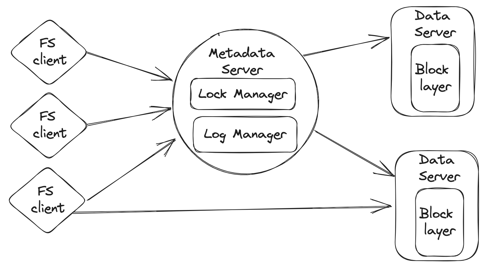
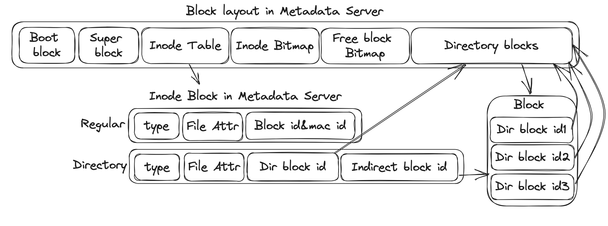
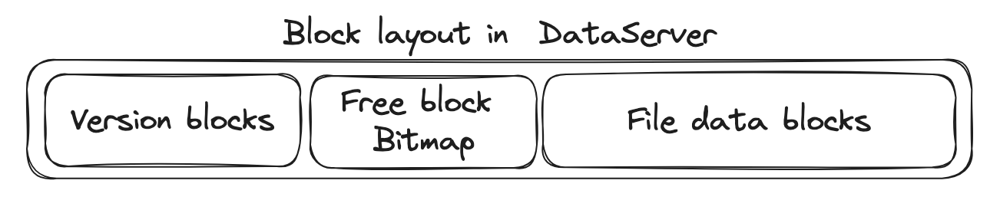

# Lab 2: Distributed FileSystem

**Hand out: Sept 24, 2023** 
**Deadline: Nov 14 23:59 No Extension**

### Lab 2 Introduction

In Lab 2, you will implement a distributed file system based on Lab 1. The overall architecture is shown below: 



As you can see, this filesystem consists of three components: **filesystem client**, **metadata server**, and **data server**.

In Lab 2, a file is split into one or more blocks, and these blocks are stored on a set of data servers. The filesystem is responsible for serving read and write requests from the filesystem client, as well as instructions like block creation and deletion from the metadata server.

The metadata server is a server that maintains all file system metadata. It stores the inode and other metadata of a file, such as the location of each block (machine id) and the `block_id` at this machine. Besides, it is responsible for serving metadata operations like file creation, deletion, and querying data block positions for reads and writes. **Note that there is only one metadata server in this lab (no replication).**

The filesystem client implements the filesystem logic by issuing RPCs to the metadata server and the data server.

**Notice:** refer to [CSE 2023 Lab 2](https://docs.qq.com/doc/DWlZya01LbWdzUFNs) first if you encounter any problems. The document contains some common problems and solutions in this lab.

### Get the Source Code

- Pull the source code of lab2 from our GitLab:

```bash
cd chfs && git pull
```

- Change it to the lab2 branch

```bash
git checkout -b lab2
```

- Merge with the code of lab1 and resolve any conflicts on your own if there are any.

```bash
git merge lab1
```

- Update submodules as there is a new submodule in lab2:

```bash
git submodule update --init --recursive
```

### Docker Container Development

You can still build the project and test your codes on the same container you used in lab1. Please refer to [lab1.md](../lab1/lab1.md) for more details.


### Implementation

We break down this lab into three parts: First, you should change the single-node filesystem in lab1 to a distributed filesystem by dividing it into data server, metadata server, and filesystem client.
Second, you should implement the lock manager in the metadata server so that the metadata server can handle concurrent requests from multiple clients and ensure before-or-after atomicity for **metadata operations**.
Finally, you need to implement the log manager in the metadata server so that the metadata server can recover from a crash to ensure that **metadata operations** are all-or-nothing.
**Notice**: These components communicate with each other by using RPC (Remote Procedure Call). Please refer to [librpc.md](librpc.md) for more details about the RPC module. **And there's an important assumption in this lab that RPC won't fail.**

### Compile Code And Test

Please also refer to [lab1.md](../lab1/lab1.md) for more details. It's the same with lab1.

---

## Demo

After finishing lab2, you can use the filesystem implemented by yourself like lab1. Since we use `docker compose` to set up the environment in this lab, you might need to install `docker compose` plugin first. You can refer to [Overview of installing Docker Compose](https://docs.docker.com/compose/install/) for more details.

Follow these steps:

- Under `chfs` directory, execute:

  ```bash
  ./scripts/lab2/start_fs.sh 
  ```

- After the script returns, there will be a `mnt` directory inside `chfs` directory.

- Enter the `mnt` directory. The filesystem you have implemented is mounted to this directory, which means that every filesystem request inside this directory will be fulfilled by the filesystem you have implemented.

- You can create a new directory:

  ```bash
  mkdir my_dir 
  ```

- Then you can create a new file inside the newly created directory:

  ```bash
  touch my_dir/a.txt 
  ```

- Check whether the file is created successfully:

  ```bash
  ls my_dir 
  ```

- After that, you can write something into this file:

  ```bash
  echo "foo" >> my_dir/a.txt
  echo "bar" >> my_dir/a.txt
  ```

- Read the file, then you will see the contents you have just written:

  ```bash
  cat my_dir/a.txt 
  ```

- Then if you do not need this file anymore, delete it:

  ```bash
  rm my_dir/a.txt 
  ```

You can refer to the `daemons/distributed/main.cc` if you are interested.


## Part 1: Distributed filesystem

### Part 1A: Data Server

In Part 1A, you will implement the data server that manages the file data. You have to implement the following functions inside `src/distributed/dataserver.cc` (You can only modify this file, do not modify any others so as to fulfill this part) :
- `read_data`: Read a piece of data in a block from the block device, provided the offset and the length of the block.
- `write_data`: Write a partial block to the block device, provided the offset and length of the written contents in the block.
- `alloc_block`: Create an empty block.
- `free_block`: Clear the contents of a block.

You may refer to the definition of class `DataServer` and the comments of these functions in `src/include/distributed/dataserver.h` for more detailed information. These functions are trivial to implement based on lab1. The only difference is they are **remote calls**. 

If your implementation is correct, you should pass the unit tests (in  `test/distributed/dataserver_test.cc`):
- `DataServerTest.AllocateAndDelete`
- `DataServerTest.ReadAndWrite`

### Part 1B: Metadata Server

In Part 1B, you will implement the metadata server operations.  We have provided the layout of blocks of the metadata server below, which is very similar to lab1: 



For directory inode, it saves all its direct and indirect block id like lab1. For file inode, it saves the mappings of all its blocks. You may refer to the definition of class `MetadataServer` and the comments of these functions in `src/include/distributed/metadata_server.h` for more detailed information.

You need to implement the following functions inside `src/distributed/metadata_server.cc` and `src/distributed/dataserver.cc`(You can modify some files in lab1 to support regular file's inode block architecture) . **Hint**: most functions follow a nearly identical implementation as lab1. 
- `mknode`: Create an inode with the given type, name, and parent.
- `unlink`: Delete a file from its parent.
- `lookup`: Try to search an inode by its name and its parent.
- `allocate_block`: Allocate a block of a file so the client can write data to the block.
- `free_block`: Free a block of a file on a data server and delete its record on the metadata server.
- `readdir`: Read the content of a directory.
- `get_block_map`: Return the block mapping of an inode. It contains the block id and machine id of each block.  **Note** that for each of the blocks, this function will also return the version of it, which is not needed right now. You may simply return 0 to pass the tests for now. Part 1C will describe the version in more detail.
- `get_type_attr`: Get the type and attribute of an inode. **Hint: in this lab, you can simply calculate the file's size by its block number**

If your implementation is correct, you should pass the unit tests:
- `MetadataServerTest.CreateDirThenLookup`
- `MetadataServerTest.WriteAnEmptyFile`
- `MetadataServerTest.CheckPersist`
- `MetadataServerTest.CheckReadDir`
- `MetadataServerTest.CheckUnlink`

You may refer to `test/distributed/metadata_server_test.cc` for the detailed implementation of these tests to help you debug.

### Part 1C: Filesystem Client

In Part 1C, you will implement the filesystem client that is responsible for all kinds of file operations, e.g., create/delete a file and read/write some contents in it. You may refer to the definition of class `ChfsClient` and the comments of these functions in `src/include/distributed/client.h` for more detailed information.

You need to implement the following functions inside `src/distributed/client.cc` (You only need to modify this file to pass this part) :
- `mknode`: Create an inode with the given type, name, and parent.
- `unlink`: Delete a file from its parent.
- `lookup`: Try to search an inode by its name and its parent.
- `readdir`: Read the content of a directory.
- `get_type_attr`: Get the type and attribute of an inode.
- `read_file`: Read the contents of a file.
- `write_file`: Write the contents of a file.
- `free_file_block`: Free a block of a file and delete its record on the metadata server.

**Notice on the implementation of read/write file**: Like GFS, if a client wants to read/write a file, it should first get the block mapping (block ids of the block belonging to this file) from the metadata server. Then it can directly send read/write requests to the corresponding blocks on data servers. If the client wants to write an empty file, it should first call the metadata server to allocate a block on a data server.

Due to this separate design, a tricky case is that there would be distributed before-or-after atomicity issues. If a client first gets the mapping of file A, another client deletes file A, and finally a third client creates a new file based on the old mapping of file A, the first client may read the wrong data. Therefore, you need to implement a version mechanism to detect such a race condition. Specifically, each block has a version number, which is stored together with the block at the data server, shown below.  Based on the version, the metadata server will also store the versions of blocks belonging to a file. These versions will be returned as a part of the mapping to the client. 

If a block no longer belongs to a file, we will first increment the block version on the dataserver. Based on this scheme, we can detect the above race by letting the data server reject block read/write requests with a mismatched version. 



To realize the above method, you need to refine the implementations of the below functions: 
- `DataServer::DataServer`: Add anything you want to persist the version of blocks on disk in the constructor.
- `DataServer::read_data`: Check whether the version is valid or not.
- `DataServer::alloc_block`: Allocate a block and update its version.
- `DataServer::free_block`: Deallocate the block and update its version.
- `MetadataServer::get_block_map`: Return the version of the block to the client too.
- `MetadataServer::allocate_block`: Record the version of the block too.

If your implementation is correct, you should pass the following unit tests:
- `DistributedClientTest.WriteAndThenRead`
- `MetadataServerTest.ReadWhenBlockIsInvalid`

You may refer to `test/distributed/distributed_client_test.cc` for the detailed implementation of these tests to help you debug.

## Part 2: Support Concurrency

In part2, we will handle the client's RPC concurrently with multiple threads. Your task in this part is to add locks in this system to keep the **Before-or-After** atomicity on these **metadata operations**. The usage of the locking method is based on you (e.g., 2PL, global lock, etc.) Hint: you can use `c++ mutex`.

If your implementation is correct, you should pass:
- `DistributedClientTest.CreateConcurrent`
- `DistributedClientTest.ReCreateWhenDelete`
- `MetadataServerTest.CheckInvariant1`
- `MetadataServerTest.CheckInvariant2`
- `MetadataServerTest.CheckInvariant3`
- `MetadataServerTest.CheckInvariant4`

You may refer to `test/distributed/distributed_client_test.cc` and `test/distributed/metadata_server_test.cc` for the detailed implementation of these tests to help you debug.

Finally,  you need to pass the following stress test.

```bash
make run_concurrent_stress_test
```

**Notice for bonus**: Before-or-after atomicity is easy to implement: just using a global lock to protect every operation. However, it may cause a performance drop. It's ok to use a global lock and you can get **95% points for this part**. But you can get at most **5% bonus score** if you use more fine-grained locks. We will evaluate your implementation using a stress test in `stress-test/concurrent.cc` with our solutions (you can also see your implementation's performance via `make run_concurrent_stress_test`). If the time it takes for your implementation to run the stress test is **1/2** of the time for a global lock implementation, you can get **100 points**.

---

## Part 3: Recover after crash

Finally, we will use **redo-logging** to ensure filesystem **metadata** operations are all-or-nothing atomic. 
Before you start this part, you should first learn the following assumptions:

- The data you write into the disk by calling `BlockManager::write_block` aren't persisted to disk immediately. These changes stay on the page cache until they're flushed to disk. In this lab, we've provided two interfaces for flushing data to disk: `BlockManager::sync` and `BlockManager::flush`. The former flushes a specific block to disk, and the latter flushes the page cache to disk. The data are persisted to disk after these calls return. You can directly use them in this part.
- Writing data to a block is atomic. That is, if you write data to a block, the data will be either fully written or not written at all.

### Part 3A: Log Manager

For simplicity, we just use a block-level value log to record operations. This means that we only record the updated block values in the log. For example, if someone creates a file, it will update at least 3 blocks, so the log will contain 3 new blocks.

At first, you should modify the `BlockManager` to support storing the log on disk, which means that you should reserve some blocks on disk for persisting log. In this lab, you will need to reserve 1024 blocks for the log. 
Then you have to implement the following functions inside `src/distributed/commit_log.cc`. We've provided a class `BlockOperation` to record one block value change. But how to get the block value changes and how to store the log on disk is up to you. **Hint: you should still keep the before-or-after atomicity in this part**

- `append_log`: Write the block value changes into the disk for persistence.
- `recover`: Read the block value changes from disk and redo the operation for all-or-nothing atomicity.

You may refer to `src/include/distributed/commit_log.h` for more information on these functions.

Afterward, you may need to modify the following metadata functions' implementations to use the above functions (**Note, you only need to ensure the atomicity of the following two functions**):

- `MetadataServer::mknode`
- `MetadataServer::rmnode`

If your implementation is correct, you should pass:
- `CommitLogTest.CheckConcurrent`
- `CommitLogTest.CheckConcurrentUnlink`
- `CommitLogTest.CheckRecoverFromFailure`

You may refer to `test/distributed/commit_log_test.cc` for the detailed implementation of these tests to help you debug.

### Part 3B: Checkpoint

As we have learned in class, storing logs could consume a lot of disk space. So we need to implement checkpoint to reduce the log size. In this part, you should implement these functions in `src/distributed/commit_log.cc`:

- `commit_log`: It marks one transaction as finished.
- `checkpoint`: Write all the finished transactions' modifications to the disk and discard their logs.
- `get_log_entry_num`: Return the number of log entries in the disk.

If your implementation is correct, you should pass:
- `CommitLogTest.CheckCheckpointFunctional`

## Run Integration Test

Like lab1, we also use [the libfuse userspace library](http://libfuse.github.io/doxygen/index.html) provided by FUSE (Filesystem in Userspace) to implement the adaptor layer. You can refer to `daemons/distributed/main.cc` for the detailed implementation. 

Running the integration test is a little bit different from lab1. We use `docker compose` to set up the environment. To launch the environment, start a shell and execute the following command under the `scripts/lab2` directory:

```bash
docker compose up
```

After this, all containers are launched and initiated. You can use `docker ps` to check the status of containers. Then open another shell and execute the following command to enter the container that mounts the filesystem:

```bash
docker exec -it lab2-fs_client-1 bash
```

The mount point is at `/tmp/mnt` in the `lab2-fs_client-1` container and you can run scripts under the `~/chfs/scripts/lab2` directory to do the integration test just like lab1.

## Grading

After you have finished all parts, firstly, compile your code by executing the following commands under the `build` directory:

```bash
make -j
make build-tests -j
```

Then, for unit tests, execute the following command under the `build` directory:

```bash
make test -j
```

For the stress test's correctness, execute the following command under the `build` directory:

```bash
make run_concurrent_stress_test
```

For the integration tests, execute the following command under the `scripts/lab2` directory:

```bash
./integration_test.sh
```

## Handin

Execute the following command under the `scripts/lab2` directory:

```bash
./handin.sh
```

Then you will see a `handin.tgz` file under the root directory of this project. Please rename it in the format of: `lab2_[your student id].tgz`, and upload this `.tgz` file to Canvas.